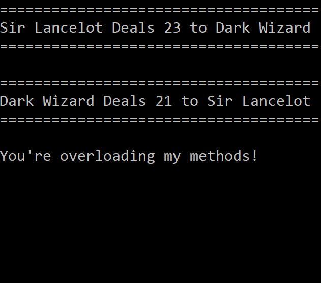
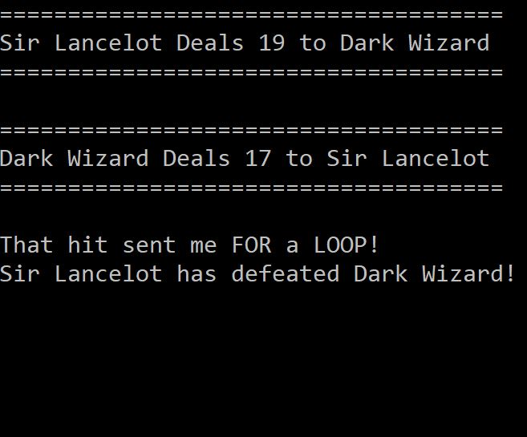

## C-Sharp-Library

**Description:** A collection of resources for learning the C# language.  These include challenges done in class, as well as other exercises completed individually.

**Extension:** Outside of class, I extended the Console Game Application (0.11_OOP_Game1).  To make the game more interesting, I adjusted the attack power and crit chance.  In the original version, the hero had an unfair advantage and almost always won; the adjustments made the enemy's attack values more random.  I also added additional wait time between screens because some of the narrative was lost.  Another fix was made to the health values.  In the original game, the battle would continue until someone's health fell below 0.  I addressed the edge case that the game would continue for another round if one of the character's health was equal to 0.  Finally, to add some humor to the game, I allowed the enemy to taunt the hero at the end of each round.  A specific coding-theme taunt would be printed to the screen, depending on the difference in their health values.  For example, if the enemy's health was significantly higher than the hero's, the enemy would say, "I'm going to send you straight into the public void!"

**You can try the game for yourself here:** https://repl.it/@MonicaM/Console-Game-App

**Screenshots of Console Game:** 

**Contact Information:** Monica Marek | monicamarek24@gmail.com
